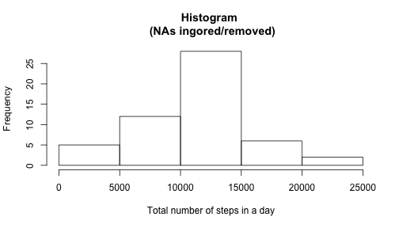
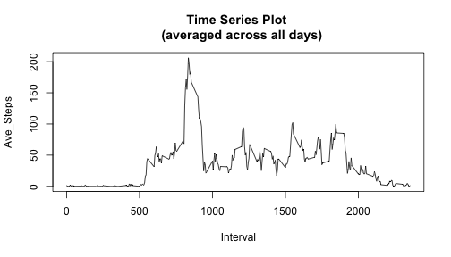
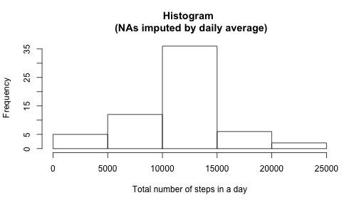
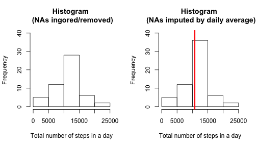
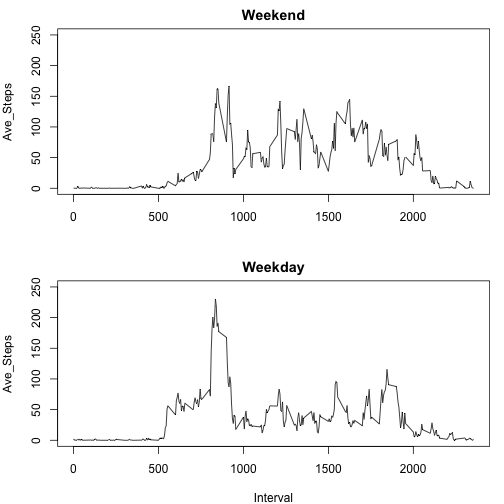

# Reproducible Research: Peer Assessment 1


```r
# Just to make sure!
opts_chunk$set(echo = TRUE)
```


## Loading and preprocessing the data

```r
# skip download - zip file already in the assignment folder

unzip("activity.zip")
rawdata = read.csv("activity.csv", stringsAsFactors = FALSE)
# str(rawdata)
rawdata$date = as.Date(rawdata$date)
# str(rawdata)
```


## What is mean total number of steps taken per day?

```r
# For this part of the assignment, you can ignore the missing values in the
# dataset.

data = na.omit(rawdata)
totalsteps.df = aggregate(data$steps, by = list(data$date), sum)
colnames(totalsteps.df) = c("Date", "TotalSteps")

# 1. Make a histogram of the total number of steps taken each day
hist(totalsteps.df$TotalSteps, xlab = "Total number of steps in a day", main = "Histogram \n (NAs ingored/removed)")
```

 


```r
# 2. Calculate and report the mean and median total number of steps taken
# per day
mean = mean(totalsteps.df$TotalSteps)
median = median(totalsteps.df$TotalSteps)
```

Ans:  
Mean of total number of steps: 1.0766 &times; 10<sup>4</sup>.
Median of total number of steps: 10765.


## What is the average daily activity pattern?

```r
# 1. Make a time series plot (i.e. type = 'l') of the 5-minute interval
# (x-axis) and the average number of steps taken, averaged across all days
# (y-axis)
AvePerInterval.df = aggregate(data$steps, by = list(data$interval), mean)
colnames(AvePerInterval.df) = c("Interval", "Ave_Steps")

with(AvePerInterval.df, plot(Interval, Ave_Steps, type = "l", main = "Time Series Plot \n  (averaged across all days)"))
```

 


```r
# 2. Which 5-minute interval, on average across all the days in the dataset,
# contains the maximum number of steps?
max_interval = AvePerInterval.df$Interval[which.max(AvePerInterval.df$Ave_Steps)]
max_ave = round(max(AvePerInterval.df$Ave_Steps), 2)
```

Ans:  
Interval 835 contains the maximum number of steps (206.17)


## Imputing missing values

```r
# 1. Calculate and report the total number of missing values in the dataset
# (i.e. the total number of rows with NAs)
missing.df = rawdata[!complete.cases(rawdata), ]
missing = nrow(missing.df)
```

Ans:  
There are a total of 2304 rows with NAs.


```r
# 2. Devise a strategy for filling in all of the missing values in the
# dataset. The strategy does not need to be sophisticated. For example, you
# could use the mean/median for that day, or the mean for that 5-minute
# interval, etc.
```


### My strategy:  
For each missing value, I will impute it with the average_steps (per certain interval) across all (nonNA) days. <This is already calculated earlier, as *AvePerInterval.df*>


```r
# 3. Create a new dataset that is equal to the original dataset but with the
# missing data filled in.

newdata = rawdata
for (i in 1:nrow(newdata)) {
    if (is.na(newdata$steps[i])) {
        average_steps_from_nonNAs = AvePerInterval.df$Ave_Steps[newdata$interval[i] == 
            AvePerInterval.df$Interval]
        newdata$steps[i] = average_steps_from_nonNAs
    }
}
```


```r
# 4. Make a histogram of the total number of steps taken each day and
# Calculate and report the mean and median total number of steps taken per
# day. Do these values differ from the estimates from the first part of the
# assignment?

new_totalsteps.df = aggregate(newdata$steps, by = list(newdata$date), sum)
colnames(new_totalsteps.df) = c("Date", "TotalSteps")
hist(new_totalsteps.df$TotalSteps, xlab = "Total number of steps in a day", 
    main = "Histogram \n (NAs imputed by daily average)")
```

 


```r
# 4.(Continued) What is the impact of imputing missing data on the estimates
# of the total daily number of steps?
summary(totalsteps.df)
```

```
##       Date              TotalSteps   
##  Min.   :2012-10-02   Min.   :   41  
##  1st Qu.:2012-10-16   1st Qu.: 8841  
##  Median :2012-10-29   Median :10765  
##  Mean   :2012-10-30   Mean   :10766  
##  3rd Qu.:2012-11-16   3rd Qu.:13294  
##  Max.   :2012-11-29   Max.   :21194
```

```r
summary(new_totalsteps.df)
```

```
##       Date              TotalSteps   
##  Min.   :2012-10-01   Min.   :   41  
##  1st Qu.:2012-10-16   1st Qu.: 9819  
##  Median :2012-10-31   Median :10766  
##  Mean   :2012-10-31   Mean   :10766  
##  3rd Qu.:2012-11-15   3rd Qu.:12811  
##  Max.   :2012-11-30   Max.   :21194
```

```r

par(mfrow = c(1, 2))
hist(totalsteps.df$TotalSteps, xlab = "Total number of steps in a day", main = "Histogram \n (NAs ingored/removed)", 
    ylim = c(0, 40))
# abline(v=median(totalsteps.df$TotalSteps), col='red', lwd=3)
hist(new_totalsteps.df$TotalSteps, xlab = "Total number of steps in a day", 
    main = "Histogram \n (NAs imputed by daily average)", ylim = c(0, 40))
abline(v = mean(totalsteps.df$TotalSteps), col = "red", lwd = 3)
```

 

Ans:  
Although there was only a very slight change based on summary statistics (slight change in median, while no change in mean), the overall distribution of the histograms are noticebly different. Specifically, there was an increase in counts in the bin where mean (marked by red)/median values exist. (Makes sense since I imputed NAs with the averages...)


## Are there differences in activity patterns between weekdays and weekends?
*For this part the weekdays() function may be of some help here. Use the dataset with the **filled-in missing values** for this part.*

```r
# 1. Create a new factor variable in the dataset with two levels – “weekday”
# and “weekend” indicating whether a given date is a weekday or weekend day.
newdata$day = rep("weekday", dim(newdata)[1])
newdata$day[weekdays(newdata$date) == "Saturday" | weekdays(newdata$date) == 
    "Sunday"] = "weekend"
```


```r
# 2. Make a panel plot containing a time series plot (i.e. type = 'l') of
# the 5-minute interval (x-axis) and the average number of steps taken,
# averaged across all weekday days or weekend days (y-axis). The plot should
# look something like the following, which was creating using simulated
# data:
day.df = aggregate(newdata$steps, by = list(newdata$interval, newdata$day), 
    mean)
colnames(day.df) = c("Interval", "Day", "Ave_Steps")
par(mfrow = c(2, 1), mar = c(4, 4, 2, 1))
with(day.df[day.df$Day == "weekend", ], plot(Interval, Ave_Steps, type = "l", 
    main = "Weekend", xlab = "", ylim = c(0, 250)))
with(day.df[day.df$Day == "weekday", ], plot(Interval, Ave_Steps, type = "l", 
    main = "Weekday", ylim = c(0, 250)))
```

 

